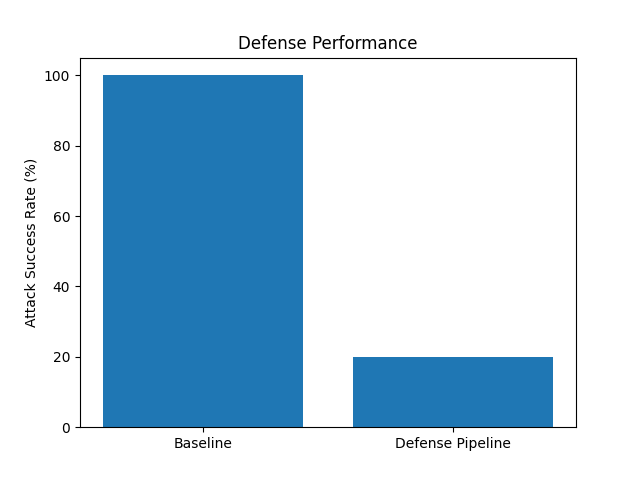
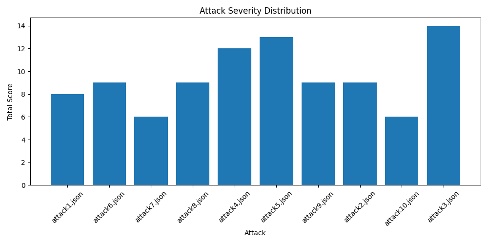

# LLM Crescendo Defense

A multi-layer defense framework for detecting and blocking Crescendo-style jailbreak attacks against Large Language Models (LLMs).

## Key Results

* Designed and implemented a defense pipeline against multi-turn Crescendo jailbreak attacks
* Integrated the framework with a locally deployed Llama-3.2-3B model using Ollama
* Evaluated the system on 10 simulated Crescendo attack conversations
* Achieved 0% Attack Success Rate (ASR) on the constructed evaluation dataset
* Generated automated evaluation reports and visualizations

---

## Motivation

Large Language Models can be manipulated through jailbreak attacks that gradually escalate a conversation from harmless topics toward harmful objectives. Unlike direct prompt attacks, Crescendo attacks rely on multi-turn dialogue, making them difficult to detect using simple keyword filtering alone.

This project investigates how a combination of risk scoring, semantic drift detection, and escalation intent monitoring can be used to identify and block such attacks before they reach the language model.

## Background

Crescendo attacks are multi-turn jailbreak attacks that gradually steer a conversation toward harmful objectives rather than relying on a single malicious prompt.

These attacks typically exploit:

* Memory stacking: building context across multiple turns
* Guard lowering: gradually reducing model resistance
* Semantic drift: shifting topics from benign to harmful domains
* Prompt disguising: hiding malicious intent behind seemingly harmless requests

Because individual turns may appear safe in isolation, Crescendo attacks are often more difficult to detect than direct jailbreak attempts.


---

## System Architecture

User Prompt
    ↓
Risk Detector
    ↓
Semantic Drift Detector
    ↓
Escalation Intent Detector
    ↓
Decision Engine
    ↓
ALLOW / BLOCK
    ↓
Llama-3.2-3B (Ollama)


Prompts classified as Medium Risk or High Risk are blocked before reaching the language model, while Low Risk prompts are forwarded for inference.

---

## Llama Integration

To align the defense framework with modern open-source language models, the system was integrated with a locally deployed Llama-3.2-3B model using Ollama.

The defense pipeline operates as a pre-inference safety layer:

* Low Risk prompts are forwarded to the model
* Medium Risk prompts are blocked
* High Risk prompts are blocked

This prevents potentially harmful requests from reaching the language model while allowing normal interactions to proceed.

No additional fine-tuning was performed. The implementation uses the publicly available Llama-3.2-3B model deployed locally through Ollama.

---
## Security Approach

The defense framework combines three independent detection mechanisms:

1. **Risk Detection** – identifies potentially harmful content using weighted keyword scoring.
2. **Semantic Drift Detection** – detects gradual topic escalation across conversations.
3. **Escalation Intent Detection** – identifies requests for operational guidance such as "step by step" or "how to".

The combined score is used to classify prompts as Low Risk, Medium Risk, or High Risk before they reach the language model.
---


## Core Components

### Risk Detector

Identifies potentially harmful content using weighted keyword scoring.

Examples include:

* Malware
* Phishing
* Fraud
* Exploitation
* Prompt Injection

### Semantic Drift Detector

Monitors how conversations evolve over time and detects gradual movement toward potentially harmful topics.

### Escalation Intent Detector

Detects operational guidance requests using phrases such as:

* "step by step"
* "how to"
* "guide"
* "instructions"
* "bypass"

### Decision Engine

Combines signals from all detection modules and classifies conversations into:

* LOW RISK
* MEDIUM RISK
* HIGH RISK

---

## Experimental Setup

### Dataset

* 10 simulated Crescendo attack conversations
* Stored in JSON format
* Evaluated using the proposed defense framework

### Evaluation Metric

Attack Success Rate (ASR)

ASR measures the percentage of attacks that successfully bypass the defense system.

---

## Results

| Metric                    | Value |
| ------------------------- | ----- |
| Total Attacks             | 10    |
| Blocked Attacks           | 10    |
| Successful Attacks        | 0     |
| Attack Success Rate (ASR) | 0%    |

The proposed defense pipeline successfully classified all attack conversations in the evaluation dataset as either Medium Risk or High Risk.
On the set of 10 simulated Crescendo attack conversations, the proposed framework achieved an Attack Success Rate (ASR) of 0%. While encouraging, these results were obtained on a limited synthetic evaluation dataset and may not generalize to all jailbreak strategies.

### ASR Comparison



### Attack Severity Distribution



---

## Technologies Used

* Python
* Ollama
* Llama-3.2-3B
* Git & GitHub
* JSON
* Matplotlib

---

## Repository Structure

```text
LLM-Crescendo-Defense/

├── attacks/
├── src/
├── results/
├── REPORT/
├── README.md
├── requirements.txt
└── .gitignore
```

## Running the Project

```bash
cd src
pip install -r requirements.txt

python3 evaluate_attacks.py
python3 export_results.py
python3 plot_results.py
python3 test_pipeline_llama.py
```

---

## Future Improvements

* Embedding-based semantic drift detection
* Transformer-based safety classifiers
* Evaluation on public jailbreak benchmarks
* Real-time conversation monitoring
* Hybrid rule-based and machine-learning defenses

---

## Author

Priyanka Verma

B.Tech Instrumentation and Control Engineering
Netaji Subhas University of Technology (NSUT)


